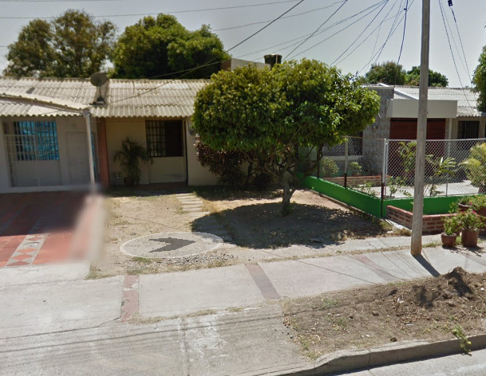

# Dame 2 Arepas, Por Favor!

## Description
My next door neighbor zipped up an important file and forgot the password. Could you help him figure it out? I think he said the password was ***bogota***? 

**NOTE:** There are two folders. IMPORTANTE, and IMPORTANTE.zip. They are both the exact same copy of eachother, except one is zipped. The other is for viewing the content of said zip file without having to unzip and whatnot. 

## Building & Executing
Unlock the provided zip file with the phrase `bogota`.

## Challenge Writeup

### Step 1.
Upon opening the challenge you are presented with a zip folder. It's locked with a password. Since the password is given, unlock it with the password **`bogota`**.

### Step 2. 
Inside that folder you find another zip folder named **CASI** along a __NOTAS.txt__ file. Using the hints, you may be lead to a youtube video of the song *"Los Caminos de La Vida, Los Diablitos."*
Translating the text in the __NOTAS.txt__ file, you can conclude that this is the old mans favorite song. Along with the 2nd hint provided, you can fill in the blanks to find the next password, **`los-caminos-de-la-vida`**.

### Step 3. 
Once unlocked, the current folder shows the final zip folder **CONTRASENAS**, as well as the last 2 hints provided to unlock it. Namely, __AQUI.txt__ & __FOTO.png__.

__AQUI.txt__ contains a reference to __foto.jpg__. Translating the text, the neighbor explains that the photo is of his birthplace. Hidden in the photo, there's metadata of where it was taken. In case the user doesn't find that, the notes also explain that the neighbor shares a birthplace with his favorite song. If you research where the band is from, you'll see *Valledupar, Colombia*. Using the password **`valledupar`** unlocks the next and final zip folder. 

### Step 4. 
Finally, once in the final folder, __CONTRASENAS__, you will find a file called **BANDERA** which contains the flag!!!! 

## Files
```
IMPORTANTE/
├────NOTAS.txt
└────CASI/
     ├────AQUI.txt
     ├────FOTO.png
     └────CONTRASENAS/
          └────BANDERA
```

**IMPORTANTE:** Main parent folder. Has 2 hints to open next folder in __NOTAS.txt__. This folder is unlocked with the password **`bogota`**. <br>
└────*NOTAS.txt:* Hint to help unlock the "CASI" folder. <br>

**CASI:** Next subfolder. Has hints in __AQUI.txt__ & __foto.png__ to open next folder. This folder is unlocked with password **`los-caminos-de-la-vida`**. <br>
├────*AQUI.txt:* 1st hint to help unlock the "CONTRASENAS" folder. <br>
└────*FOTO.png:* 2nd hint to help unlock the "CONTRASENAS" folder. Also has some hints in the form of metadata. <br>

**CONTRASENAS:** Last folder. Contains the flag. This folder is unlocked with the password **`valledupar`**. <br>
└────*BANDERA:* Flag is here! <br>

## Flag
`FLAG{C0L0MB1A_H4S_DA_B3ST_FO0D_3VER}`

## English Translation/Preview of Contents
#### NOTAS.txt
```
Hey friend! I'm writing this here so that you don't forget your passwords.

Here you can find photos of my beloved Colombia. Oh how I miss my country. So in that case, MAKE SURE YOU DON'T FORGET THE PASSWORD OF THIS FOLDER!

In case that happens, I have some "hints" so that you don't forget. The first is my favorite song.

= = = = HINT #1 = = = =
watch?v=I-cOD2x-qBs&list=RDI-cOD2x-qBs&index=1
= = = = = = = = = = = =

= = = = HINT #2 = = = =
_ _ _-_ _ _ _ _ _ _-_ _-_ _-_ _ _ _

☝️ Here you'll find the password.
```

#### AQUI.txt
```
You're almost there! I didn't want to make it that easy to guess my friend haha!

The next "hint" is a foto of my birthplace. It is also the same place where my favorite song was born! 

= = = = HINT #3 = = = =
./foto.jpg
= = = = = = = = = = = =
```

#### FOTO.png
</img>

#### BANDERAS
```
You did it! CONGRATS! Happy Hacking :-)

= = = = = = = = = = = = = = = = = = 

FLAG{C0L0MB1A_H4S_DA_B3ST_FO0D_3VER}

= = = = = = = = = = = = = = = = = = 
```
